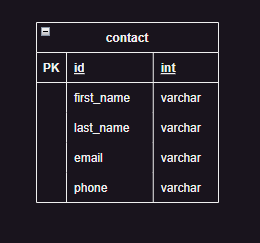
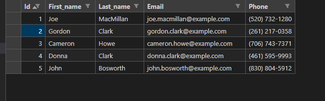

# contacts-mvc-php
MVC CRUD using PHP(Codegniter)

# Table Structure

You can find the creation and the insertion SQL scripts in the documents table.

# Database and intial data 

You are going to work with a database in memory with the following structure

        
and the initial data is the following

